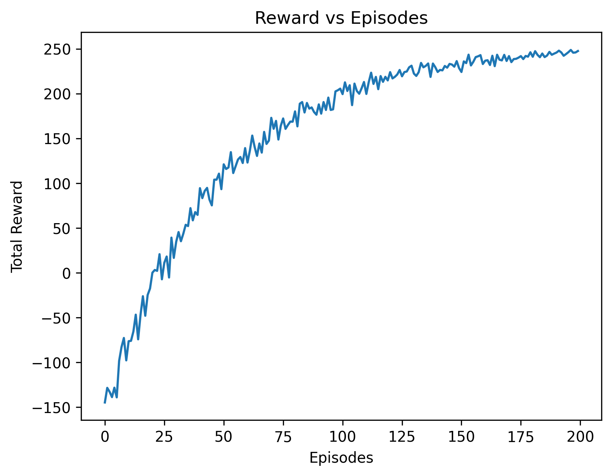
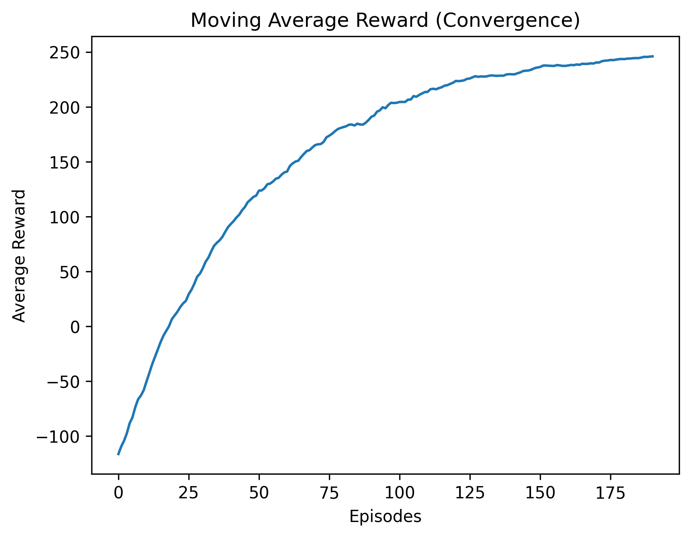

# Deep Reinforcement Learning for Cloud-Edge Resource Allocation Using IoT Data

## Overview

This project implements a Reinforcement Learning (Q-Learning) framework for intelligent resource allocation in Cloud-Edge computing environments using IoT sensor data.

The objective is to improve resource allocation decisions by considering multiple performance metrics such as CPU usage, memory usage, network latency, jitter, and task execution time.

---

## Features

- Reinforcement Learning based Resource Allocation
- Custom IoT Environment
- Q-Learning Agent
- Multi-objective Reward Function
- Data Preprocessing and Feature Scaling
- Performance Evaluation
- Baseline Comparison
- Ablation Study
- Performance Visualization

---

## Technologies Used

- Python
- NumPy
- Pandas
- Matplotlib
- Scikit-learn
- Reinforcement Learning (Q-Learning)
- Jupyter Notebook / Kaggle

---

## Project Structure

```text
IoT-Resource-Allocation-Using-Reinforcement-Learning
│
├── notebook/
├── images/
├── dataset/
├── results/
├── README.md
├── requirements.txt
├── LICENSE
└── .gitignore
```

---

## Results

The project evaluates the Q-Learning model using:

- Reward per Episode
- Moving Average Reward
- Baseline Performance Comparison
- Performance Metrics
- Ablation Study
## Performance Graphs

### Reward vs Episodes



---

### Moving Average Reward



---

## Dataset

The dataset used in this project was obtained from Kaggle.

If the dataset is not included in this repository, please download it separately and update the dataset path in the notebook.

---

## Future Improvements

- Deep Q-Network (DQN)
- Double DQN
- Multi-Agent Reinforcement Learning
- Edge AI Deployment
- TinyML Integration

---

## Author

**Masrath Bawazeer**

B.Tech Computer Science and Engineering

Aspiring Data Analyst | Python Developer | AI & Machine Learning Enthusiast

---

⭐ If you found this project helpful, consider giving it a star.